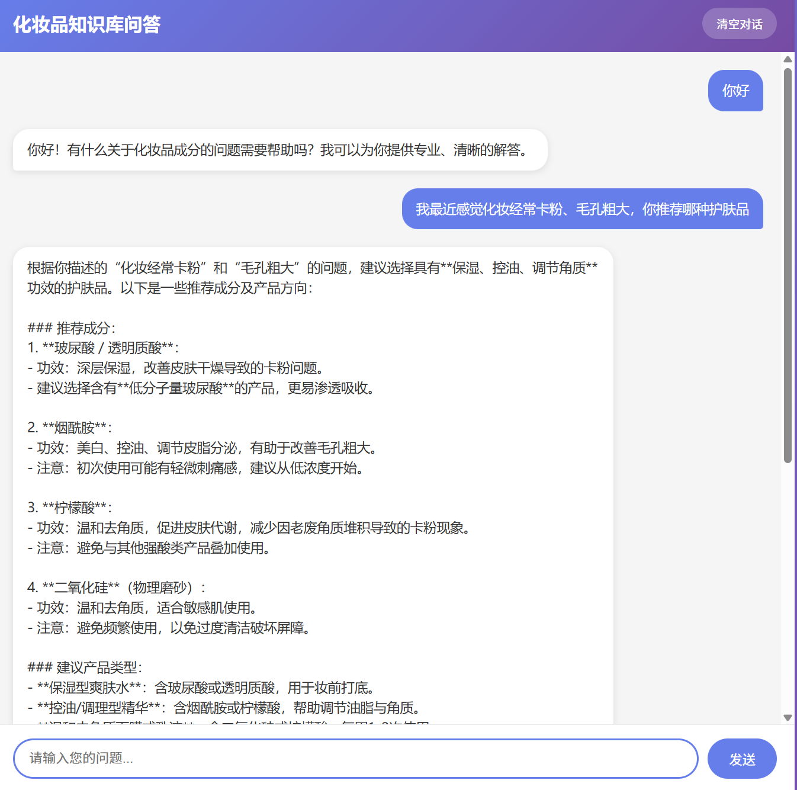
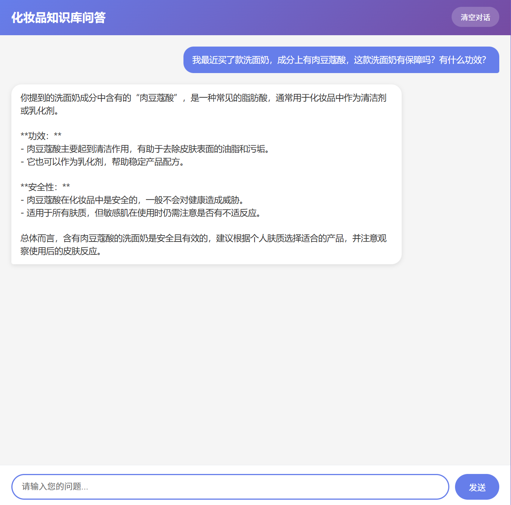
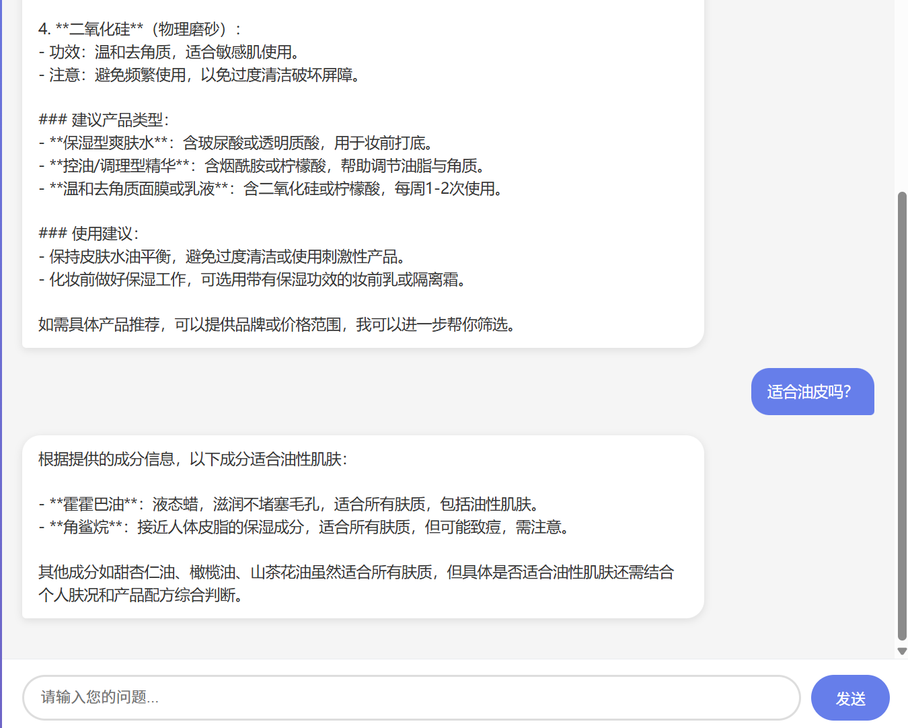

# 化妆品知识库问答系统 (makeUp-RAG)

本系统是一个基于 RAG（检索增强生成）技术的化妆品成分智能问答系统，旨在帮助用户快速查询化妆品成分的功效、安全性及适用肤质等信息。

在日常生活中，消费者面对复杂的化妆品成分表往往无从下手，不了解哪些成分适合自己的肤质，也不清楚成分之间的相互作用及注意事项。同时，化妆品配方师在进行产品研发时，需要花费大量时间查阅各类成分资料。本系统通过自然语言处理和向量检索技术，将167种常用化妆品成分的结构化信息存储于向量知识库中，用户只需以自然语言提问（如"敏感肌可以用什么美白成分？"），系统即可自动完成语义理解、向量化检索、上下文构建，最终由大语言模型生成专业的回答。

在日常生活中，消费者面对复杂的化妆品成分表往往无从下手，不了解哪些成分适合自己的肤质，也不清楚成分之间的相互作用及注意事项。同时，化妆品配方师在进行产品研发时，需要花费大量时间查阅各类成分资料。本系统通过自然语言处理和向量检索技术，将167种常用化妆品成分的结构化信息存储于向量知识库中，用户只需以自然语言提问（如"敏感肌可以用什么美白成分？"），系统即可自动完成语义理解、向量化检索、上下文构建，最终由大语言模型生成专业的回答。
-技术实现层面，系统采用阿里巴巴 DashScope 的 text-embedding-v1 模型将文本映射到1536维向量空间，使用 Facebook 的 FAISS 库进行高效的相似度检索，后端基于 Flask 框架搭建 Web 服务，前端采用原生 HTML+CSS+JS 实现可视化交互。完整的 RAG 流程包括：用户 Query 输入、文本向量化、FAISS 相似度搜索、上下文构建、通义千问 LLM 推理生成回答。

本项目适用于 AI 应用开发岗位的面试展示，能够完整呈现企业级 RAG 系统的工程实现思路，包括中文文本处理、向量库的持久化、批量 Embedding 优化、LLM 对话接口设计等核心技术点。

## 效果展示

| 主页界面 | 问答演示 | 多轮对话 |
|:-------:|:-------:|:-------:|
|  |  |  |

## 技术栈

| 组件 | 技术选型 | 说明 |
|------|----------|------|
| Embedding | DashScope text-embedding-v1 | 1536维向量 |
| LLM | DashScope qwen-turbo | 通义千问 |
| 向量检索 | FAISS | Facebook AI Similarity Search |
| 框架 | LangChain | langchain_community |
| 后端 | Flask | Python Web框架 |
| 前端 | HTML+CSS+JS | 原生开发，无框架依赖 |

## 系统架构

```
┌──────────────────────────────────────────────────────────────────┐
│                          用户提问                               │
│                   "我想美白，推荐什么成分？"                      │
└────────────────────────────┬───────────────────────────────────┘
                             │
                             ▼
┌──────────────────────────────────────────────────────────────────┐
│                      1. Query 输入                               │
│              用户自然语言问题                                    │
└────────────────────────────┬───────────────────────────────────┘
                             │
                             ▼
┌──────────────────────────────────────────────────────────────────┐
│                  2. Text Embedding                               │
│         text-embedding-v1 (1536维向量)                           │
│                                                                 │
│         "我想美白..." → [0.012, -0.034, 0.089, ...]             │
└────────────────────────────┬───────────────────────────────────┘
                             │
                             ▼
┌──────────────────────────────────────────────────────────────────┐
│                 3. Similarity Search                            │
│              FAISS + L2距离 + Top-K检索                          │
│                                                                 │
│              → 377、烟酰胺、维生素C...                           │
└────────────────────────────┬───────────────────────────────────┘
                             │
                             ▼
┌──────────────────────────────────────────────────────────────────┐
│                    4. Context 构建                              │
│          将检索结果格式化为LLM输入上下文                          │
│                                                                 │
│     【1】377 功效:美白 适用:非敏感肌...                          │
│     【2】烟酰胺 功效:美白|抗氧化...                              │
└────────────────────────────┬───────────────────────────────────┘
                             │
                             ▼
┌──────────────────────────────────────────────────────────────────┐
│                   5. LLM 推理                                    │
│             qwen-turbo 生成自然语言回答                           │
│                                                                 │
│     "根据您的需求，想要美白的话，我推荐以下成分..."              │
└──────────────────────────────────────────────────────────────────┘
```

## 功能特性

- [x] 完整RAG流程：Query → Embedding → Search → Context → LLM
- [x] 向量检索：FAISS L2距离 + Top-K近邻检索
- [x] LLM推理：通义千问基于上下文生成回答
- [x] Web界面：可视化展示RAG各环节
- [x] 实时指标：搜索时间、LLM推理时间显示

## 快速开始

### 环境要求

- Python 3.8+
- Conda

### 1. 克隆项目

```bash
git clone https://github.com/your-username/cosmetic-qa-system.git
cd cosmetic-qa-system
```

### 2. 创建虚拟环境

```bash
conda create -n AICC python=3.11
conda activate AICC
```

### 3. 安装依赖

```bash
pip install dashscope faiss-cpu langchain langchain-community flask
```

### 4. 配置 DashScope API Key

在 `config.py` 中设置你的 API Key，或在环境变量中设置：

```bash
export DASHSCOPE_API_KEY="your-api-key-here"
```

> 获取 API Key: https://dashscope.console.aliyun.com/

### 5. 启动服务

```bash
python web_app.py
```

### 6. 访问Web界面

浏览器打开: http://127.0.0.1:5003

## 项目结构

```
cosmetic-qa-system/
├── config.py              # 配置文件
├── main.py               # 命令行版本（测试用）
├── web_app.py            # Web版本（带UI界面）
├── embeddings.py         # Embedding + LLM模块
├── vectorstore.py       # 向量存储模块
├── templates/
│   └── index.html      # 前端页面
├── 成分功效数据.csv    # 化妆品成分知识库 (167条)
└── README.md           # 项目说明
```

## 核心代码说明

### Embedding模块 (embeddings.py)

```python
from embeddings import get_embedder, get_llm

# 获取向量化模型
embedder = get_embedder()
query_vector = embedder.embed_query("我想美白")

# 获取LLM模型
llm = get_llm()
answer = llm.generate(prompt="问题", context="检索到的上下文")
```

### 向量存储 (vectorstore.py)

```python
from vectorstore import CosmeticVectorStore

# 创建向量存储
vector_store = CosmeticVectorStore(embedding_dim=1536)
vector_store.create_vector_store(documents, embedder)

# 相似度检索
results = vector_store.similarity_search("问题", top_k=5)
```

## 知识库数据

包含 **167种** 化妆品成分，字段：

| 字段 | 说明 | 示例 |
|------|------|------|
| 成分名称 | 成分名称 | 烟酰胺、透明质酸、377 |
| 功效分类 | 主要功效 | 美白、保湿、抗氧化 |
| 适用肤质 | 适用肤质 | 所有肤质/敏感肌/非敏感肌 |
| 注意事项 | 使用注意 | 需避光保存、孕妇禁用 |
| 简要说明 | 简要描述 | 抑制黑色素转移的美白成分 |

## 示例问答

### Q: 我想要美白，推荐什么成分？

**检索结果**:
- 377 - 强效美白成分抑制酪氨酸酶
- 烟酰胺 - 抑制黑色素转移
- 维生素C - 抗氧化抑制黑色素生成

**LLM回答**:
> 根据您的需求，想要美白的话，我推荐以下成分：
> 
> 1. **377** - 这是目前效果最强的美白成分之一，能有效抑制酪氨酸酶的活性，减少黑色素生成。适合非敏感肌使用，需避光保存。
> 
> 2. **烟酰胺** - 可以抑制黑色素转移到皮肤表层，同时有美白和抗氧化的功效。适合所有肤质，初期使用可能有轻微刺痛。
> 
> 3. **维生素C** - 经典的抗氧化美白成分，能还原黑色素。适合非敏感肌，同样需要避光保存。

### Q: 敏感肌可以用什么成分？

**LLM回答**:
> 您是敏感肌的话，以下成分比较适合：
> 
> 1. **神经酰胺** - 修复皮肤屏障的关键成分，能增强皮肤防御能力
> 
> 2. **洋甘菊提取物** - 含有红没药醇，有很好的舒缓抗敏作用
> 
> 3. **燕麦提取物** - 能缓解皮肤瘙痒，温和不刺激

## 面试要点提示

如果面试 AI 应用开发岗位，可以重点强调：

1. **完整RAG流程**：Query → Embedding → Search → Context → LLM
2. **Embedding处理**：text-embedding-v1模型，1536维向量，批量处理(25条/批)
3. **向量检索**：FAISS + L2距离 + Top-K检索
4. **LLM推理**：通义千问，基于上下文生成非模板化回答
5. **工程实现**：中文编码处理、向量库持久化、可视化RAG流程

## 进阶配置

### 调整Top-K参数

```python
# 在 web_app.py 中修改
result = qa_system.query_with_steps(question, top_k=10)
```

### 切换LLM模型

```python
# 在 embeddings.py 中修改
llm = DashScopeLLM(model="qwen-plus")  # 切换到qwen-plus
```

### 切换向量库

```python
# 在 vectorstore.py 中修改
USE_FAISS = False  # 切换到Milvus
```

## 注意事项

1. DashScope API有免费额度限制，请妥善保管 API Key
2. Windows路径建议使用英文路径避免编码问题
3. 首次启动会自动构建向量库，需要一定时间
## 核心代码说明

## 参考资料

- [DashScope 文本向量Embedding](https://help.aliyun.com/document_detail/2394213.html)
- [DashScope 通义千问](https://help.aliyun.com/document_detail/2394199.html)
- [FAISS GitHub](https://github.com/facebookresearch/faiss)
- [LangChain Vectorstores](https://python.langchain.com/docs/integrations/vectorstores/)


---

### 可选优化：多路召回（Multi-Channel Retrieval）

**问题**：单一向量检索可能遗漏语义接近但表述不同的内容

**解决方案**：同时使用多种检索策略，结果合并去重

```python
def multi_channel_retrieval(query, top_k=5):
    """多路召回"""

    # 1. 向量检索
    vector_results = vector_store.similarity_search(query, top_k=top_k)

    # 2. 关键词检索（BM25）
    keyword_results = keyword_search(query, top_k=top_k)

    # 3. 同义词扩展检索
    expanded_query = expand_synonyms(query)
    expanded_results = vector_store.similarity_search(expanded_query, top_k=top_k)

    # 合并结果
    all_results = merge_and_deduplicate(
        [vector_results, keyword_results, expanded_results]
    )

    return all_results[:top_k]
```

**关键思路**：不同检索通道的结果按相关性加权合并

---

### 4. 可选优化：BGE Reranker 重排

**问题**：向量检索基于Top-K，可能存在相关性排序不准确的问题

**解决方案**：引入专门的重排模型（如 BAAI/bge-reranker-base）对初检结果进行二次排序

```python
from FlagEmbedding import FlagReranker

# 初始化重排模型
reranker = FlagReranker("BAAI/bge-reranker-base")

def rerank_results(query, retrieval_results, top_k=3):
    """对检索结果进行重排"""

    # 构建query-doc对
   (documents, scores) = zip(*[
        (r['description'], 0) for r in retrieval_results
    ])

    # 使用reranker计算相关性分数
    reranked_scores = reranker.compute_score(
        [(query, doc) for doc in documents]
    )

    # 按分数排序
    ranked = sorted(zip(retrieval_results, reranked_scores),
                  key=lambda x: x[1], reverse=True)

    return ranked[:top_k]
```

**效果**：Reranker模型会理解query和doc的语义关系，给出更准确的排序

---

---

## 许可证

MIT License
